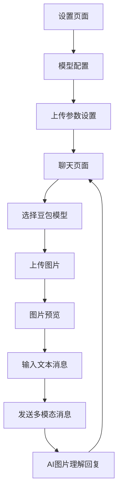

## 1. Product Overview

为FastAPI AI聊天应用增加图片上传和理解功能，用户可以上传图片并与AI进行多模态对话。该功能专门针对豆包模型的图片理解能力进行优化，提供更丰富的交互体验。

## 2. Core Features

### 2.1 User Roles

| Role | Registration Method | Core Permissions |
|------|---------------------|------------------|
| Default User | 无需注册 | 可上传图片、发送文本消息、使用豆包模型进行图片理解 |

### 2.2 Feature Module

我们的图片上传与理解功能包含以下主要页面：
1. **聊天页面**：图片上传组件、图片预览、多模态消息显示
2. **设置页面**：模型选择、图片上传限制配置

### 2.3 Page Details

| Page Name | Module Name | Feature description |
|-----------|-------------|---------------------|
| 聊天页面 | 图片上传组件 | 支持拖拽上传、点击选择文件，限制图片格式为jpg/png/gif，最大5MB |
| 聊天页面 | 图片预览 | 显示上传图片缩略图，支持删除和重新选择 |
| 聊天页面 | 多模态消息显示 | 在聊天记录中显示图片消息和AI回复，支持图片放大查看 |
| 聊天页面 | 模型提示 | 当选择非豆包模型时显示图片理解不可用提示 |
| 设置页面 | 模型选择 | 突出显示豆包模型支持图片理解，其他模型标注仅支持文本 |
| 设置页面 | 上传配置 | 设置图片大小限制、支持格式等参数 |

## 3. Core Process

### 用户操作流程

1. 用户在聊天页面选择豆包模型
2. 点击图片上传按钮或拖拽图片到上传区域
3. 系统验证图片格式和大小，显示预览
4. 用户输入文本描述（可选）并发送
5. 后端将图片转换为base64格式发送给豆包API
6. 豆包模型返回图片理解结果
7. 前端显示AI回复，包含图片分析内容

## 4. User Interface Design

### 4.1 Design Style

- 主色调：保持现有的蓝色主题 (#007bff)
- 辅助色：图片上传区域使用浅灰色背景 (#f8f9fa)
- 按钮样式：圆角按钮，图片上传使用虚线边框
- 字体：继续使用系统默认字体，图片相关提示使用14px
- 布局风格：卡片式设计，图片消息使用独立卡片
- 图标样式：使用📷、🖼️等emoji图标

### 4.2 Page Design Overview

| Page Name | Module Name | UI Elements |
|-----------|-------------|-------------|
| 聊天页面 | 图片上传组件 | 虚线边框的拖拽区域，居中显示📷图标和"点击或拖拽上传图片"文字 |
| 聊天页面 | 图片预览 | 150x150px缩略图，右上角删除按钮，底部显示文件名和大小 |
| 聊天页面 | 多模态消息 | 用户消息显示图片+文本，AI回复使用特殊样式突出图片分析内容 |
| 聊天页面 | 模型提示 | 橙色警告框，提示"当前模型不支持图片理解，请选择豆包模型" |
| 设置页面 | 模型选择 | 豆包模型标注🖼️图标，其他模型显示"仅文本"标签 |

### 4.3 Responsiveness

产品采用移动端优先设计，图片上传组件在手机端优化触摸操作，支持相机拍照和相册选择。桌面端支持拖拽上传，平板端兼容触摸和鼠标操作。