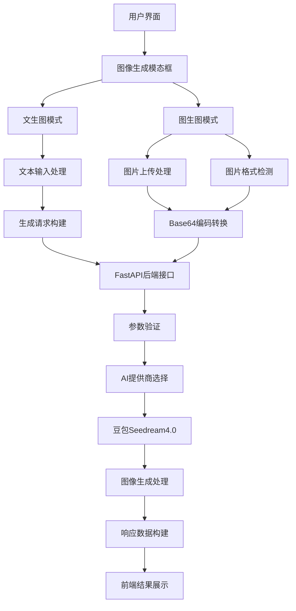

# FastAPI开发AI应用教程七：新增文生图、图生图

本文将深入讲解如何在 FastAPI AI 聊天应用中实现文生图和图生图功能，重点介绍豆包 Seedream 4.0 图像生成模型的强大能力。通过本教程，你将学会如何构建完整的 AI 图像生成系统，包括文生图、图生图等图像输出核心技术。

> 📖 项目地址：<https://github.com/wayn111/fastapi-ai-chat-demo>
>
> 温馨提示：本文全文约一万字，看完约需 15 分钟。

## 项目概述

想象一下，当你向 AI 描述一个场景时，AI 能够立即为你生成对应的高质量图像；当你上传一张图片时，AI 能够基于你的描述对图片进行创意改造——这就是我们要实现的文生图和图生图功能！用户可以通过文字描述生成全新的图像，也可以上传参考图片进行风格转换、内容编辑和创意重构。

### 核心功能

* **文本生成图像（Text-to-Image）**：基于自然语言描述生成高质量图像

* **图像生成图像（Image-to-Image）**：基于参考图片和文字描述进行图像转换

* **多模态输入处理**：支持文本、图像的组合输入和融合创作

* **4K 高清输出**：支持最高 4K 分辨率的图像生成

* **秒级生成体验**：借助先进推理加速技术实现快速图像生成

### 技术栈

* **后端框架**：FastAPI（高性能异步 Web 框架）

* **图像生成模型**：豆包 Seedream 4.0（支持 4K 多模态生图）

* **图片处理**：Pillow（Python 图像处理库）

* **数据编码**：Base64（图片数据传输编码）

* **前端交互**：HTML5 File API + JavaScript（图片上传和预览）

* **数据存储**：Redis（消息持久化）

### 豆包 Seedream 4.0 模型介绍

豆包·图像创作模型 Seedream 4.0 是字节跳动正式发布的新一代图像生成模型，是集生成与编辑于一体的一站式图像创作解决方案。值得一提的是，9月11日晚，Seedream 4.0 在 Artificial Analysis「文生图」和「图像编辑」两大榜单荣登榜首，充分证明了其在业界的领先地位。

#### 🎨 核心能力特性

**业界首款 4K 多模态生图**：Seedream 4.0 是业界首款支持 4K 分辨率的多模态图像生成模型，能够灵活处理文本、图像的组合输入，实现多图融合创作、参考生图、组合生图、图像编辑等核心功能。主体一致性相比前代版本显著提升，生成的图像质量和细节表现力大幅增强。

**极致推理性能**：借助先进的推理加速技术，Seedream 4.0 的推理速度较 Seedream 3.0 版本提升超过 10 倍，最快可在秒级时间内生成 2K 高清图片，为用户提供近乎实时的图像生成体验。

**突破性文字渲染**：在文字处理方面突破了以往生成模型的瓶颈，不仅能正确渲染出清晰的文字内容，还能一定程度上处理公式、表格、化学结构、统计图等复杂排版，为专业应用场景提供强有力支持。

#### 🚀 应用场景

Seedream 4.0 可广泛应用于多个领域，为企业提供稳定、优质且风格统一的视觉输出解决方案，显著提升工作效率：

* **电商营销**：产品展示图、广告创意图、营销海报生成

* **商业设计**：品牌视觉、包装设计、UI/UX 原型图

* **专业海报**：活动宣传、展览海报、信息图表

* **影视动漫**：概念设计、分镜头图、角色设定

* **教育互动**：教学素材、互动内容、知识图解

* **文旅文创**：文化创意、旅游宣传、艺术创作

* **内容创作**：社交媒体配图、博客插图、创意素材

## 核心架构设计

### 🏗️ 系统架构图



### 🎯 数据模型设计

#### 图像生成请求模型

```python
class ImageGenerationAPIRequest(BaseModel):
    """图片生成API请求模型"""
    prompt: str = Field(..., description="图片生成提示词")
    size: Optional[str] = Field("1024x1024", description="图片尺寸")
    image_data: Optional[str] = Field(None, description="参考图片数据 (base64编码，图片生成图片模式)")
    provider: Optional[str] = Field("doubao", description="AI提供商")
    image_type: Optional[str] = Field(None, description="图片类型")
```

这个模型定义了图像生成请求的完整数据结构，支持纯文本生成图像和基于参考图片的图像转换两种模式。

#### 图像生成响应模型

```python
class ImageGenerationAPIResponse(BaseModel):
    """图片生成API响应模型"""
    success: bool = Field(..., description="是否成功")
    message: str = Field(..., description="响应消息")
    data: Optional[dict] = Field(None, description="图片数据")
    provider: str = Field(..., description="使用的AI提供商")
    timestamp: float = Field(..., description="时间戳")
```

#### AI提供商基础模型

```python
@dataclass
class ImageGenerationRequest:
    """图片生成请求数据类"""
    prompt: str
    size: str = "1024x1024"
    image_data: Optional[str] = None
    image_type: Optional[str] = None

@dataclass
class ImageGenerationResponse:
    """图片生成响应数据类"""
    url: Optional[str] = None
    b64_json: Optional[str] = None
    revised_prompt: Optional[str] = None
```

## 核心功能实现

### 🎨 后端图像生成接口实现

#### 主要API接口

```python
@app.post("/generate/image", response_model=ImageGenerationAPIResponse)
async def generate_image(request: ImageGenerationAPIRequest):
    """图片生成API接口

    支持两种模式：
    1. 纯文本生成图片：仅提供prompt参数
    2. 图片生成图片：提供prompt和image_data参数
    """
    logger.info(f"接收图片生成请求 - 提示词: {request.prompt[:50]}..., 提供商: {request.provider}")

    try:
        # 获取AI提供商
        provider_obj = ai_manager.get_provider(request.provider)
        if not provider_obj:
            raise HTTPException(status_code=400, detail=f"不支持的AI提供商: {request.provider}")

        # 检查提供商是否支持图片生成
        if not hasattr(provider_obj, 'generate_image'):
            raise HTTPException(status_code=400, detail=f"提供商 {request.provider} 不支持图片生成功能")

        # 构建图片生成请求
        generation_request = ImageGenerationRequest(
            prompt=request.prompt,
            size=request.size,
            quality=request.quality,
            image_data=request.image_data,
            image_type=request.image_type
        )

        logger.info(f"开始生成图片 - 提供商: {request.provider}, 模式: {'图片生成图片' if request.image_data else '文本生成图片'}")
        generation_response = await provider_obj.generate_image(generation_request)

        logger.info(f"图片生成成功 - 提供商: {request.provider}, URL: {generation_response.url[:50] if generation_response.url else 'N/A'}...")

        # 构建响应数据
        response_data = {
            "image_url": generation_response.url,
            "image_b64": generation_response.b64_json,
            "revised_prompt": generation_response.revised_prompt,
            "size": request.size,
            "quality": request.quality,
        }

        return ImageGenerationAPIResponse(
            success=True,
            message="图片生成成功",
            data=response_data,
            provider=request.provider,
            timestamp=time.time()
        )

    except Exception as e:
        logger.error(f"图片生成失败: {e}")
        return ImageGenerationAPIResponse(
            success=False,
            message=f"图片生成失败: {str(e)}",
            data=None,
            provider=request.provider,
            timestamp=time.time()
        )
```

#### 豆包提供商图像生成实现

```python
class DoubaoProvider(OpenAICompatibleProvider):
    """豆包AI提供商实现类"""
    
    def __init__(self):
        super().__init__()
        self.IMAGE_GENERATION_MODEL = "doubao-seed-1.6"  # Seedream 4.0模型
        
    async def generate_image(self, request: ImageGenerationRequest) -> ImageGenerationResponse:
        """
        生成图片功能实现
        支持纯文本生成图片和图片生成图片两种模式

        Args:
            request: 图片生成请求对象

        Returns:
            ImageGenerationResponse: 图片生成响应对象
        """
        try:
            if not self.client:
                logger.error("Doubao客户端未初始化，无法生成图片")
                return ImageGenerationResponse(
                    url=None,
                    b64_json=None,
                    revised_prompt=None,
                    model=self.IMAGE_GENERATION_MODEL,
                    provider=self.PROVIDER_NAME
                )

            # 构建图片生成请求参数
            image_params = {
                'model': self.IMAGE_GENERATION_MODEL,
                'prompt': request.prompt,
                'size': request.size or "2K",  # 豆包支持的尺寸格式
                'response_format': request.response_format or "url",
                'extra_body': {
                    'watermark': request.watermark if request.watermark is not None else True
                }
            }

            # 如果提供了输入图片URL，则为图片生成图片模式
            if request.image_data:
                image_params['extra_body']['image'] = f"data:image/{request.image_type};base64,{request.image_data}"
                logger.info(f"Doubao图片生成图片模式 - 输入图片: {request.image_data}")
            else:
                logger.info("Doubao纯文本生成图片模式")

            logger.info(f"调用Doubao图片生成API - 模型: {self.IMAGE_GENERATION_MODEL}, 提示词: {request.prompt[:50]}...")

            # 调用豆包图片生成API
            response = self.client.images.generate(**image_params)

            # 构建响应对象
            if response.data and len(response.data) > 0:
                image_data = response.data[0]

                image_response = ImageGenerationResponse(
                    url=getattr(image_data, 'url', None),
                    b64_json=getattr(image_data, 'b64_json', None),
                    revised_prompt=getattr(image_data, 'revised_prompt', request.prompt),
                    model=self.IMAGE_GENERATION_MODEL,
                    provider=self.PROVIDER_NAME
                )

                logger.info(f"Doubao图片生成成功 - URL: {image_response.url is not None}")
                return image_response
            else:
                logger.error("Doubao图片生成响应为空")
                return ImageGenerationResponse(
                    url=None,
                    b64_json=None,
                    revised_prompt=request.prompt,
                    model=self.IMAGE_GENERATION_MODEL,
                    provider=self.PROVIDER_NAME
                )

        except Exception as e:
            logger.error(f"Doubao图片生成失败: {e}")
            return ImageGenerationResponse(
                url=None,
                b64_json=None,
                revised_prompt=request.prompt,
                model=self.IMAGE_GENERATION_MODEL,
                provider=self.PROVIDER_NAME
            )
```

### 🖼️ 前端图像生成界面实现

#### 图像生成模态框HTML结构

```html
<!-- 图片生成模态框 -->
<div id="imageGenerateModal" class="modal">
    <div class="modal-content">
        <div class="modal-header">
            <h3>AI 图片生成</h3>
            <span class="close" onclick="hideImageGenerateModal()">&times;</span>
        </div>
        <div class="modal-body">
            <!-- 生成模式选择 -->
            <div class="generate-mode-selector">
                <button id="textToImageBtn" class="mode-btn active" onclick="switchGenerateMode('text')">
                    📝 文生图
                </button>
                <button id="imageToImageBtn" class="mode-btn" onclick="switchGenerateMode('image')">
                    🖼️ 图生图
                </button>
            </div>
            
            <!-- 基础图片上传区域（图生图模式） -->
            <div id="baseImageSection" class="base-image-section" style="display: none;">
                <label for="baseImageUpload" class="upload-label">
                    <div class="upload-area">
                        <span class="upload-icon">📁</span>
                        <span class="upload-text">点击选择基础图片</span>
                        <span class="upload-hint">支持 JPG、PNG、GIF 格式，最大 10MB</span>
                    </div>
                </label>
                <input type="file" id="baseImageUpload" accept="image/*" style="display: none;" onchange="handleBaseImageSelect(event)">
                <div id="baseImagePreview" class="image-preview"></div>
            </div>
            
            <!-- 提示词输入 -->
            <div class="prompt-section">
                <label for="imagePrompt">描述你想要的图片：</label>
                <textarea id="imagePrompt" placeholder="请详细描述你想要生成的图片内容，例如：一只可爱的橘猫坐在窗台上，阳光透过窗户洒在它身上，背景是城市风景..." rows="4"></textarea>
            </div>
            
            <!-- 生成参数设置 -->
            <div class="generation-settings">
                <div class="setting-group">
                    <label for="imageSize">图片尺寸：</label>
                    <select id="imageSize">
                        <option value="1024x1024">1024×1024 (正方形)</option>
                        <option value="1024x1792">1024×1792 (竖版)</option>
                        <option value="1792x1024">1792×1024 (横版)</option>
                    </select>
                </div>
                <div class="setting-group">
                    <label for="imageQuality">图片质量：</label>
                    <select id="imageQuality">
                        <option value="standard">标准</option>
                        <option value="hd">高清</option>
                    </select>
                </div>
            </div>
        </div>
        <div class="modal-footer">
            <button id="generateImageBtn" class="generate-btn" onclick="generateImage()">
                🎨 生成图片
            </button>
        </div>
    </div>
</div>
```

#### 核心JavaScript实现

```javascript
/**
 * 切换图片生成模式
 * @param {string} mode - 生成模式：'text' 或 'image'
 */
function switchGenerateMode(mode) {
    const textBtn = document.getElementById('textToImageBtn');
    const imageBtn = document.getElementById('imageToImageBtn');
    const baseImageSection = document.getElementById('baseImageSection');
    
    if (mode === 'text') {
        // 文生图模式
        textBtn.classList.add('active');
        imageBtn.classList.remove('active');
        baseImageSection.style.display = 'none';
        currentGenerateMode = 'text';
    } else {
        // 图生图模式
        imageBtn.classList.add('active');
        textBtn.classList.remove('active');
        baseImageSection.style.display = 'block';
        currentGenerateMode = 'image';
    }
}

/**
 * 处理基础图片选择
 * @param {Event} event - 文件选择事件
 */
async function handleBaseImageSelect(event) {
    const file = event.target.files[0];
    if (!file) return;

    // 文件类型验证
    const allowedTypes = ['image/jpeg', 'image/jpg', 'image/png', 'image/gif', 'image/webp'];
    if (!allowedTypes.includes(file.type)) {
        alert('请选择有效的图片文件（JPG、PNG、GIF、WebP）');
        return;
    }

    // 文件大小验证
    const maxSize = 10 * 1024 * 1024; // 10MB
    if (file.size > maxSize) {
        alert('图片文件大小不能超过 10MB');
        return;
    }

    try {
        // 调用upload/image接口上传图片并获取格式信息
        const formData = new FormData();
        formData.append('file', file);

        const uploadResponse = await fetch('/upload/image', {
            method: 'POST',
            body: formData
        });

        if (!uploadResponse.ok) {
            throw new Error(`上传失败: ${uploadResponse.status}`);
        }

        const uploadResult = await uploadResponse.json();
        
        if (uploadResult.success) {
            // 保存上传结果
            baseImageFile = {
                data: uploadResult.data.base64_data,
                type: uploadResult.data.content_type.split('/')[1] // 从content_type提取格式
            };
            
            // 显示图片预览
            const preview = document.getElementById('baseImagePreview');
            preview.innerHTML = `
                <div class="preview-container">
                    
                    <button class="remove-btn" onclick="removeBaseImage()">&times;</button>
                </div>
            `;
        } else {
            throw new Error(uploadResult.message || '上传失败');
        }
    } catch (error) {
        console.error('图片上传失败:', error);
        alert('图片上传失败: ' + error.message);
    }
}

/**
 * 生成图片主函数
 */
async function generateImage() {
    const prompt = document.getElementById('imagePrompt').value.trim();
    const size = document.getElementById('imageSize').value;
    const quality = document.getElementById('imageQuality').value;
    const mode = currentGenerateMode;

    // 输入验证
    if (!prompt) {
        alert('请输入图片描述');
        return;
    }

    if (mode === 'image' && !baseImageFile) {
        alert('请选择基础图片');
        return;
    }

    const generateBtn = document.getElementById('generateImageBtn');
    const originalText = generateBtn.textContent;
    generateBtn.disabled = true;
    generateBtn.textContent = '生成中...';

    try {
        // 构建请求数据
        const requestData = {
            prompt: prompt,
            size: size,
            quality: quality,
            provider: 'doubao'
        };

        // 如果是图生图模式，添加图片数据
        if (mode === 'image' && baseImageFile) {
            requestData.image_data = baseImageFile.data;
            requestData.image_type = baseImageFile.type;
        } else {
            // 文生图模式，设置默认图片类型
            requestData.image_type = 'png';
        }

        console.log('发送图片生成请求:', {
            prompt: prompt.substring(0, 50) + '...',
            size: size,
            quality: quality,
            mode: mode,
            hasImage: !!requestData.image_data
        });

        // 发送生成请求
        const response = await fetch('/generate/image', {
            method: 'POST',
            headers: {
                'Content-Type': 'application/json'
            },
            body: JSON.stringify(requestData)
        });

        if (!response.ok) {
            throw new Error(`请求失败: ${response.status}`);
        }

        const result = await response.json();
        
        if (result.success && result.data && result.data.image_b64) {
            // 生成成功，显示图片
            const imageData = result.data.image_b64;
            const imageUrl = `data:image/png;base64,${imageData}`;

            // 创建图片消息并添加到聊天区域
            const messageDiv = document.createElement('div');
            messageDiv.className = 'message assistant-message';
            messageDiv.innerHTML = `
                <div class="message-avatar">
                    
                </div>
                <div class="message-content">
                    <div class="generated-image">
                        
                        <div class="image-info">
                            <span class="image-size">${size}</span>
                            <span class="image-quality">${quality}</span>
                            <span class="generation-mode">${mode === 'text' ? '文生图' : '图生图'}</span>
                        </div>
                    </div>
                    <div class="generation-prompt">
                        <strong>生成提示词：</strong>${prompt}
                    </div>
                </div>
            `;

            // 添加到聊天容器
            const chatContainer = document.getElementById('chatContainer');
            chatContainer.appendChild(messageDiv);
            chatContainer.scrollTop = chatContainer.scrollHeight;

            // 关闭模态框并重置
            hideImageGenerateModal();
            resetImageGenerateForm();
            
            // 显示成功消息
            showNotification('图片生成成功！', 'success');
        } else {
            throw new Error(result.message || '图片生成失败');
        }

    } catch (error) {
        console.error('图片生成失败:', error);
        alert('图片生成失败: ' + error.message);
    } finally {
        // 恢复按钮状态
        generateBtn.disabled = false;
        generateBtn.textContent = originalText;
    }
}

/**
 * 重置图片生成表单
 */
function resetImageGenerateForm() {
    document.getElementById('imagePrompt').value = '';
    document.getElementById('imageSize').value = '1024x1024';
    document.getElementById('imageQuality').value = 'standard';
    document.getElementById('baseImagePreview').innerHTML = '';
    baseImageFile = null;
    switchGenerateMode('text');
}

/**
 * 显示通知消息
 * @param {string} message - 通知内容
 * @param {string} type - 通知类型：'success', 'error', 'info'
 */
function showNotification(message, type = 'info') {
    const notification = document.createElement('div');
    notification.className = `notification ${type}`;
    notification.textContent = message;
    
    document.body.appendChild(notification);
    
    // 3秒后自动移除
    setTimeout(() => {
        if (notification.parentNode) {
            notification.parentNode.removeChild(notification);
        }
    }, 3000);
}
```

## xiang

### 🎯 文生图功能特性

**智能提示词理解**：Seedream 4.0 具备强大的自然语言理解能力，能够准确解析用户的文字描述，包括物体、场景、风格、情感等多维度信息，生成符合预期的高质量图像。

**多样化风格支持**：支持写实、卡通、油画、水彩、素描等多种艺术风格，用户可以通过在提示词中指定风格关键词来获得不同艺术效果的图像。

**精确尺寸控制**：提供多种预设尺寸选项，包括正方形（1024×1024）、竖版（1024×1792）、横版（1792×1024）等，满足不同应用场景的需求。

### 🖼️ 图生图功能特性

**参考图像理解**：能够深度分析上传的参考图像，理解其中的构图、色彩、风格、主体等元素，为后续的图像转换提供准确的基础信息。

**风格迁移能力**：基于参考图像和文字描述，实现风格迁移、内容替换、场景重构等多种图像转换效果，保持主体一致性的同时实现创意变换。

**智能图像融合**：支持多图融合创作，能够将多个参考图像的元素进行智能组合，创造出全新的视觉效果。

### ⚡ 性能优化特性

**推理加速技术**：采用先进的模型优化和推理加速技术，相比前代版本推理速度提升超过 10 倍，实现秒级图像生成体验。

**智能缓存机制**：对常用的提示词和参数组合进行智能缓存，减少重复计算，进一步提升响应速度。

**资源动态调配**：根据请求负载动态调配计算资源，确保在高并发场景下仍能保持稳定的生成速度。

## 应用场景与最佳实践

### 📱 电商营销应用

**产品展示图生成**：通过文字描述快速生成产品在不同场景下的展示图，如"一款时尚手表放在大理石桌面上，旁边有咖啡和杂志，温暖的阳光从窗户洒进来"。

**广告创意图制作**：基于产品图片和营销文案，生成具有吸引力的广告创意图，提升营销效果。

### 🎨 内容创作应用

**社交媒体配图**：为博客文章、社交媒体帖子快速生成匹配的配图，提升内容的视觉吸引力。

**教育素材制作**：生成教学插图、概念图解、历史场景重现等教育素材，丰富教学内容。

### 🎬 影视动漫应用

**概念设计图**：为影视项目快速生成概念设计图，包括场景设计、角色设定、道具设计等。

**分镜头图制作**：基于剧本描述生成分镜头图，帮助导演和制作团队更好地可视化故事情节。

## 技术优势与创新点

### 🚀 技术创新

**4K 高清直出**：业界首次实现 4K 分辨率的直接输出，无需后期放大处理，保证图像质量和细节表现。

**多模态融合架构**：采用先进的多模态融合技术，实现文本、图像信息的深度整合，提升生成效果的准确性和一致性。

**端到端优化**：从模型训练到推理部署的全链路优化，确保在保证质量的前提下实现最佳性能表现。

### 💡 用户体验创新

**直观的双模式界面**：提供文生图和图生图两种模式的无缝切换，用户可以根据需求灵活选择生成方式。

**实时预览反馈**：上传的参考图片支持实时预览，用户可以直观地看到输入内容，确保生成效果符合预期。

**智能参数推荐**：根据输入内容和历史使用习惯，智能推荐最适合的尺寸、质量等参数设置。

## 总结

通过本教程，我们成功实现了基于豆包 Seedream 4.0 的文生图和图生图功能。这套系统不仅具备强大的图像生成能力，还提供了优秀的用户体验和稳定的技术架构。主要成果包括：

**功能完整性**：实现了从文本描述到图像生成、从参考图片到风格转换的完整功能链路，支持多种生成模式和参数配置。

**技术先进性**：采用了业界领先的 Seedream 4.0 模型，支持 4K 高清输出、秒级生成速度和智能文字渲染等先进特性。

**架构可扩展性**：基于 FastAPI 的异步架构设计，支持高并发访问和多提供商扩展，为未来功能升级奠定了坚实基础。

**用户体验优化**：提供了直观的操作界面、实时的生成反馈和完善的错误处理机制，确保用户能够轻松使用各项功能。

随着 AI 图像生成技术的不断发展，我们的系统也将持续优化和升级，为用户提供更加强大和便捷的图像创作体验。未来可以考虑增加批量生成、风格模板、图像编辑等更多高级功能，进一步提升系统的实用性和竞争力。
